DESeq2 Output Clustering
================
Matthew Berginski
3/23/2020

# Read in DESeq2 Normalized Log Changes

## Kinase Clustering

## Output Kinase Cluster Lists

``` r
kinase_hier_clusters = as.data.frame(cutree(kinase_cluster_ratio,k = 15))
names(kinase_hier_clusters) <- "cluster_num"
kinase_hier_clusters = kinase_hier_clusters %>%
    rownames_to_column(var = "hgnc_symbol") %>%
    arrange(cluster_num, hgnc_symbol) %>%
    left_join(all_kinases %>% select(class, symbol), by=c('hgnc_symbol'='symbol')) %>%
    write_csv(here('cluster_sets/DESeq_kinase_correlation_clusters.csv'))
```

    ## Warning: Column `hgnc_symbol`/`symbol` joining character vector and factor,
    ## coercing into character vector

``` r
kinase_cluster_counts = kinase_hier_clusters %>% 
    count(cluster_num, name = "Total Kinases") %>%
    left_join(kinase_hier_clusters %>% filter(class == "Dark") %>% count(cluster_num, name="Understudied Count")) %>%
    left_join(kinase_hier_clusters %>% filter(class == "Light") %>% count(cluster_num, name="Well Studied Count")) %>%
    write_csv(here('cluster_sets/DESeq_kinase_correlation_counts.csv'))
```

    ## Joining, by = "cluster_num"
    ## Joining, by = "cluster_num"

## Visualize Changes in Kinase Expression

``` r
treatment_summary = DESeq_ratios %>% 
    group_by(treatment) %>%
    summarise(mean_log2 = mean(log2FoldChange,na.rm=T),
                        lower_log2 = tidy(t.test(log2FoldChange))$conf.low,
                        upper_log2 = tidy(t.test(log2FoldChange))$conf.high)

cluster_treatment_summary = DESeq_ratios %>% 
    left_join(kinase_hier_clusters) %>% 
    filter(!is.na(cluster_num)) %>%
    group_by(cluster_num,treatment) %>% 
    summarise(mean_log2 = mean(log2FoldChange,na.rm=T),
                        lower_log2 = tidy(t.test(log2FoldChange))$conf.low,
                        upper_log2 = tidy(t.test(log2FoldChange))$conf.high)
```

    ## Joining, by = "hgnc_symbol"

``` r
for (this_cluster in sort(unique(kinase_hier_clusters$cluster_num))) {
    this_plot = ggplot(cluster_treatment_summary %>% filter(cluster_num == this_cluster),
                 aes(x=treatment,y=mean_log2, group=cluster_num)) +
        geom_pointrange(aes(ymin=lower_log2,ymax=upper_log2)) +
        ggtitle(paste('Drug Response Profile for Cluster: ', this_cluster)) +
        
        geom_pointrange(data = treatment_summary, 
                                aes(ymin=lower_log2,ymax=lower_log2, group='overall'), color='blue',alpha=0.25) +
        # geom_line(data = treatment_summary, aes(x=treatment,y=mean_log2, group='overall'), color='blue',alpha=0.5) +
        
        
        theme_berginski() +
        theme(axis.text.x=element_text(angle = -90, hjust = 0,vjust=0.5)) +
        xlab('') +
        ylab('Average Shrunk Log2 Fold Change') +
        ylim(c(-2.5,2.5))
    print(this_plot)
}
```

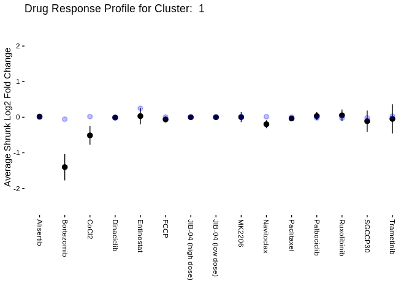<!-- -->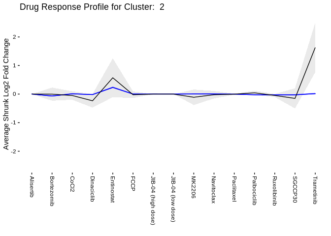<!-- -->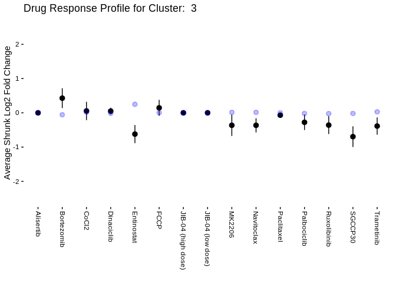<!-- -->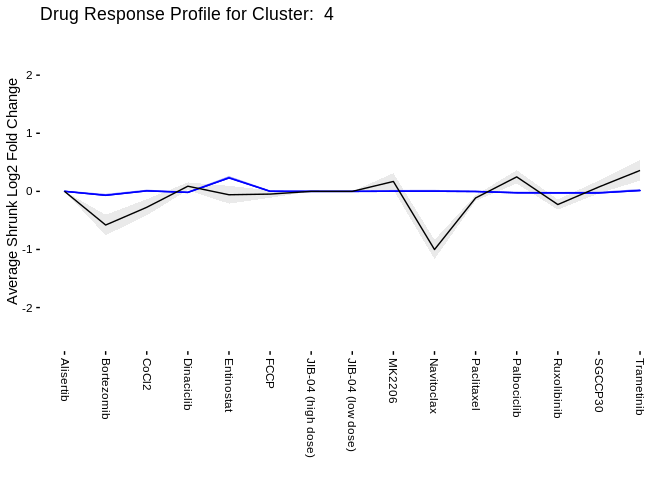<!-- -->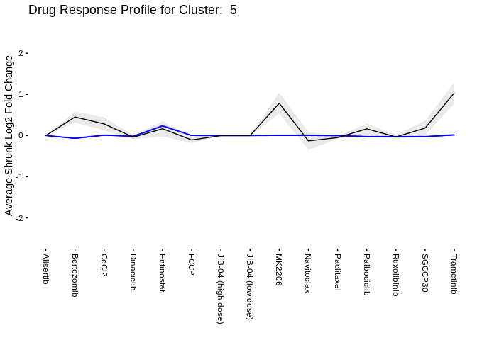<!-- -->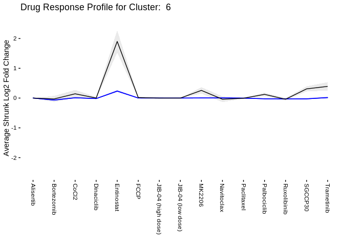<!-- --><!-- -->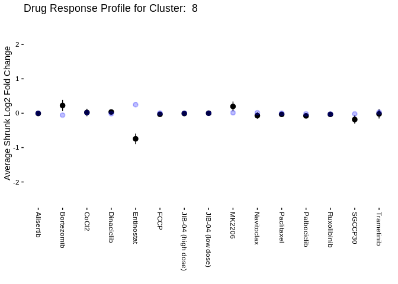<!-- -->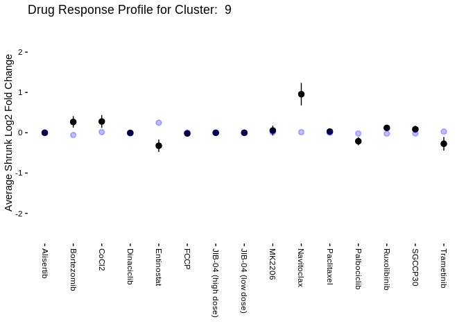<!-- -->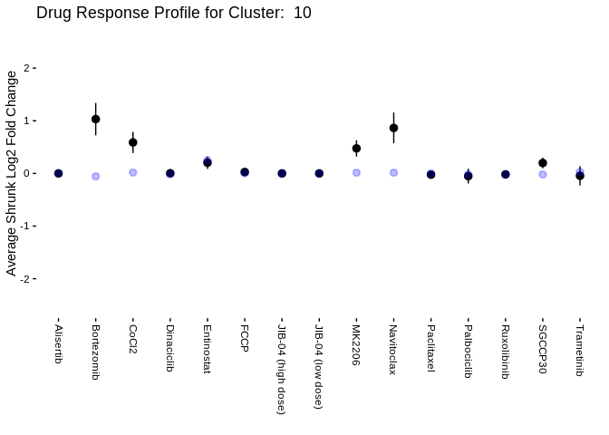<!-- -->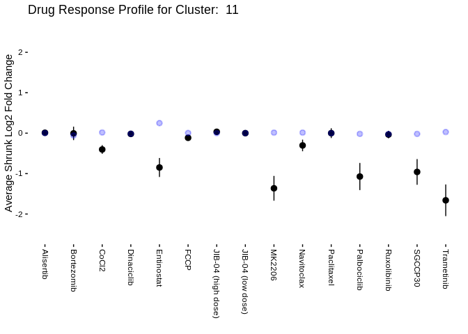<!-- -->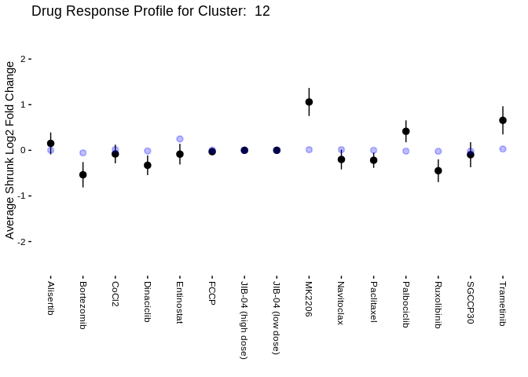<!-- -->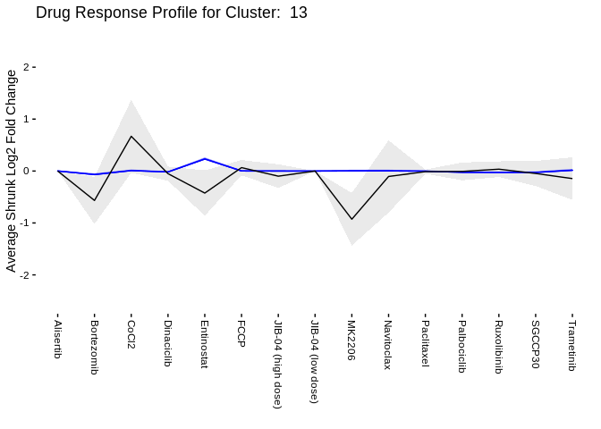<!-- -->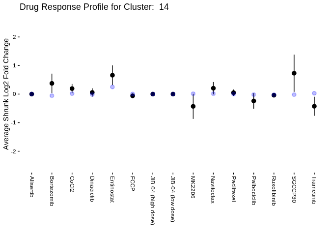<!-- -->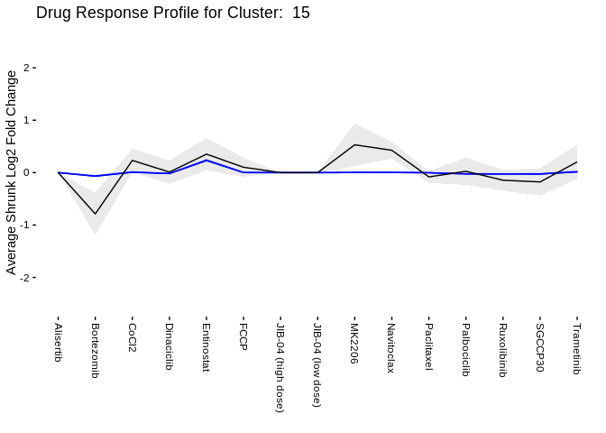<!-- -->
