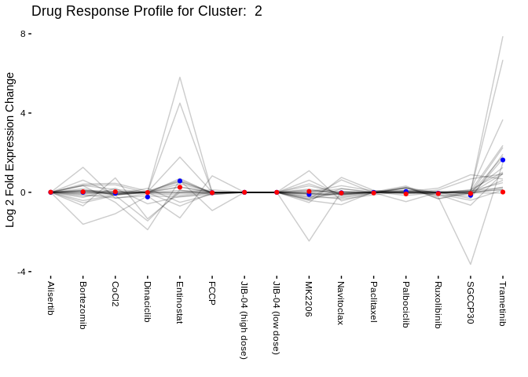

DESeq2 Output Clustering
================
Matthew Berginski
3/23/2020

# Read in DESeq2 Normalized Log Changes

## Data Organizing/Filtering

## Experiment UMAP Vis

``` r
correlation_vals = data.frame(
    cor_vals = as.vector((experiment_correlations_ratio - 1)*-1)
)

ggplot(correlation_vals, aes(x=cor_vals)) + 
    geom_histogram() +
    xlab('Pairwise Treatment Correlations') +
    ylab('') +
    geom_vline(aes(xintercept = mean(cor_vals)), color='red') +
    theme_berginski()
```

    ## `stat_bin()` using `bins = 30`. Pick better value with `binwidth`.

<!-- -->

``` r
ggsave(here('figures/clustering/experiment_correlation_vals.png'),height=4,width=4)
```

    ## `stat_bin()` using `bins = 30`. Pick better value with `binwidth`.

``` r
ggplot(segment(ddata_x)) +
    geom_segment(aes(x=x, y=y, xend=xend, yend=yend)) +
    geom_text(data = dendro_labels,
                        aes(label = label, x=x,y=0), angle=90, hjust=1.1) +
    # ylim(c(-1,NA)) +
    xlab('') +
    theme_berginski() +
    theme(axis.title.x=element_blank(),
                axis.text.x=element_blank(),
                axis.ticks.x=element_blank()) +
    # scale_y_discrete("Correlation Distance", waiver(), waiver(), c(0,2)) +
    scale_y_continuous("Kinase Correlation Distance", breaks = c(0,0.5,1), limits = c(-0.8,NA))
```

<!-- -->

``` r
    NULL
```

    ## NULL

``` r
ggsave(here('figures/clustering/experiment_cluster_tree.png'),height=4,width=4)
trimImage(here('figures/clustering/experiment_cluster_tree.png'))
```

### UMAP on DESeq Log2 fold Results

``` r
umap_settings = umap.defaults
umap_settings$min_dist = 0.01

kinase_correlations_ratio_umap = drug_perturb_ratio_wide_kinases %>%
    column_to_rownames(var='hgnc_symbol') %>%
    umap() %>%
    identity()

kinase_ratio_plot = data.frame(umap_1 = kinase_correlations_ratio_umap$layout[,1],
                                                             umap_2 = kinase_correlations_ratio_umap$layout[,2],
                                                             symbol = drug_perturb_ratio_wide_kinases$hgnc_symbol) %>%
    left_join(all_kinases %>% select(symbol, class)) %>%
    mutate(label = case_when(
        # class == "Dark" ~ symbol,
        symbol == "PKMYT1" ~ symbol,
        symbol == "TLK2" ~ symbol,
        symbol == "CDK12" ~ symbol,
        symbol == "CDK13" ~ symbol,
        # symbol == "PIP5K1B" ~ symbol,
        TRUE ~ ""
    ))
```

    ## Joining, by = "symbol"

    ## Warning: Column `symbol` joining factors with different levels, coercing to
    ## character vector

``` r
library(ggrepel)
library(BerginskiRMisc)
ggplot(kinase_ratio_plot, aes(x=umap_1,y=umap_2,color = class,label = label)) +
    geom_point(alpha=0.75) + theme_berginski() + xlab('UMAP 1') + ylab('UMAP 2') +
    geom_text_repel(
        segment.size  = 0.2,
    segment.color = "grey50",
    force = 10)
```

<!-- -->

``` r
ggsave(here('figures/clustering/kinase_cluster_ratio_umap.png'))
```

    ## Saving 7 x 5 in image

``` r
kinase_correlations_ratio = amap::Dist(drug_perturb_ratio_wide_kinases %>% 
                                                                                column_to_rownames(var = "hgnc_symbol"),
                                                                             method="correlation")

kinase_correlations_ratio = amap::Dist(drug_perturb_ratio_wide_kinases %>% 
                                                                                column_to_rownames(var = "hgnc_symbol"),
                                                                             method="correlation",upper=T)
```

``` r
umap_settings = umap.defaults
umap_settings$min_dist = 0.001
umap_settings$n_neighbors = 10
umap_settings$random_state = 1234
umap_settings$input = "dist"

kinase_correlations_ratio_umap = kinase_correlations_ratio %>%
    as.matrix() %>%
    umap(config = umap_settings)

kinase_ratio_plot = data.frame(umap_1 = kinase_correlations_ratio_umap$layout[,1],
                                                             umap_2 = kinase_correlations_ratio_umap$layout[,2],
                                                             symbol = drug_perturb_ratio_wide_kinases$hgnc_symbol) %>%
    left_join(all_kinases %>% select(symbol, class)) %>%
    mutate(label = case_when(
        # class == "Dark" ~ symbol,
        symbol == "PKMYT1" ~ symbol,
        symbol == "TLK2" ~ symbol,
        # symbol == "BRSK2" ~ symbol,
        symbol == "CDK12" ~ symbol,
        symbol == "CDK13" ~ symbol,
        symbol == "SBK1" ~ symbol,
        symbol == "CDC42BPG" ~ symbol,
        symbol == "PAK3" ~ symbol,
        # symbol == "PIP5K1B" ~ symbol,
        TRUE ~ ""
    )) %>%
    identity()
```

    ## Joining, by = "symbol"

    ## Warning: Column `symbol` joining factors with different levels, coercing to
    ## character vector

``` r
library(ggrepel)
library(BerginskiRMisc)
ggplot(kinase_ratio_plot, aes(x=umap_1, y=umap_2, label = label,  color = class)) +
    geom_point(alpha = 0.75) + theme_berginski() + xlab('UMAP 1') + ylab('UMAP 2') +
    geom_text_repel(
        segment.size  = 1,
    segment.color = "grey50",
    force = 20,
        show.legend = FALSE) +
    scale_color_discrete(name="Kinase Type")
```

<!-- -->

``` r
ggsave(here('figures/clustering/kinase_cluster_ratio_correlation_umap.png'))
```

    ## Saving 7 x 5 in image

## Output Kinase Cluster Lists

``` r
kinase_hier_clusters = as.data.frame(cutree(kinase_cluster_ratio,k = 15))
names(kinase_hier_clusters) <- "cluster_num"
kinase_hier_clusters = kinase_hier_clusters %>%
    rownames_to_column(var = "hgnc_symbol") %>%
    arrange(cluster_num, hgnc_symbol) %>%
    left_join(all_kinases %>% select(class, symbol), by=c('hgnc_symbol'='symbol')) %>%
    write_csv(here('cluster_sets/DESeq_kinase_correlation_clusters.csv'))
```

    ## Warning: Column `hgnc_symbol`/`symbol` joining character vector and factor,
    ## coercing into character vector

``` r
kinase_cluster_counts = kinase_hier_clusters %>% 
    count(cluster_num, name = "Total Kinases") %>%
    left_join(kinase_hier_clusters %>% filter(class == "Dark") %>% count(cluster_num, name="Understudied Count")) %>%
    left_join(kinase_hier_clusters %>% filter(class == "Light") %>% count(cluster_num, name="Well Studied Count")) %>%
    write_csv(here('cluster_sets/DESeq_kinase_correlation_counts.csv'))
```

    ## Joining, by = "cluster_num"
    ## Joining, by = "cluster_num"

``` r
library(gridExtra)
```

    ## 
    ## Attaching package: 'gridExtra'

    ## The following object is masked from 'package:dplyr':
    ## 
    ##     combine

``` r
p<-tableGrob(kinase_hier_clusters %>% 
                            group_by(cluster_num,class) %>% 
                            count() %>% 
                            pivot_wider(names_from = 'class',values_from = n) %>%
                            rename('Cluster Number'="cluster_num"),
                         rows = NULL)
grid.arrange(p)
```

<!-- -->

``` r
ggsave(here('figures/clustering/kinase_clustering_table.png'),p)
```

    ## Saving 7 x 5 in image

``` r
trimImage(here('figures/clustering/kinase_clustering_table.png'))
```

``` r
end_points_clusters = end_points %>% left_join(kinase_hier_clusters, by=c('label' = 'hgnc_symbol'))

ggplot(segment(ddata_x)) +
    geom_segment(aes(x=x, y=y, xend=xend, yend=yend)) +
    # geom_text(data = dendro_labels,
    #                   aes(label = label, x=x,y=0, color = class), angle=90, hjust=1) +
    # ylim(c(-0.5,2)) +
    # geom_hline(aes(yintercept = 1.2), color='red') +
    xlab('') +
    # geom_point(data = end_points, mapping = aes(x=xend,y=yend-0.02, color=class),shape='\u007C') +
    # geom_rect(data = end_points, mapping = aes(xmin=xend-0.5,xmax=xend+0.5,ymin=yend-0.25,ymax=yend-0.01,fill=class)) +
    geom_rect(data = end_points_clusters, 
                        mapping = aes(xmin=xend-0.5, 
                                                    xmax=xend+0.5, 
                                                    ymin=yend-0.01,
                                                    ymax=yend-0.25,
                                                    fill=as.factor(cluster_num))) +
    theme_berginski() +
    theme(axis.title.x=element_blank(),
                axis.text.x=element_blank(),
                axis.ticks.x=element_blank()) +
    scale_y_continuous(name = "Correlation Distance",breaks=seq(0,2,by=0.5)) +
    scale_x_continuous(name = "",expand=c(0,0)) +
    scale_fill_discrete(name = "Kinase Cluster")
```

<!-- -->

``` r
ggsave(here('figures/clustering/kinase_clustering_cluster_color.png'),width=10,dpi = 300)
```

    ## Saving 10 x 5 in image

``` r
trimImage(here('figures/clustering/kinase_clustering_cluster_color.png'))
```

``` r
umap_settings = umap.defaults
umap_settings$min_dist = 0.01
umap_settings$input = "dist"

kinase_correlations_ratio_umap = kinase_correlations_ratio %>%
    as.matrix() %>%
    umap(config = umap_settings)

kinase_ratio_plot = data.frame(umap_1 = kinase_correlations_ratio_umap$layout[,1],
                                                             umap_2 = kinase_correlations_ratio_umap$layout[,2],
                                                             symbol = drug_perturb_ratio_wide_kinases$hgnc_symbol) %>%
    left_join(all_kinases %>% select(symbol, class)) %>%
    left_join(kinase_hier_clusters %>% select(hgnc_symbol,cluster_num), by = c('symbol'='hgnc_symbol')) %>%
    mutate(label = case_when(
        # class == "Dark" ~ symbol,
        symbol == "PKMYT1" ~ symbol,
        symbol == "TLK2" ~ symbol,
        symbol == "BRSK2" ~ symbol,
        symbol == "CDK12" ~ symbol,
        symbol == "CDK13" ~ symbol,
        # symbol == "PIP5K1B" ~ symbol,
        TRUE ~ ""
    ))
```

    ## Joining, by = "symbol"

    ## Warning: Column `symbol` joining factors with different levels, coercing to
    ## character vector

``` r
library(ggrepel)
library(BerginskiRMisc)
ggplot(kinase_ratio_plot, aes(x=umap_1,y=umap_2,label = label, color=as.factor(cluster_num))) +
    geom_point() + theme_berginski() + xlab('UMAP 1') + ylab('UMAP 2') +
    geom_text_repel(
        segment.size  = 0.2,
    segment.color = "grey50",
    force = 10)
```

<!-- -->

``` r
ggsave(here('figures/clustering/kinase_cluster_ratio_umap.png'))
```

    ## Saving 7 x 5 in image

## Output Kinase Cluster Lists

``` r
kinase_hier_clusters = as.data.frame(cutree(kinase_cluster_ratio,k = 15))
names(kinase_hier_clusters) <- "cluster_num"
kinase_hier_clusters = kinase_hier_clusters %>%
    rownames_to_column(var = "hgnc_symbol") %>%
    arrange(cluster_num, hgnc_symbol) %>%
    left_join(all_kinases %>% select(class, symbol), by=c('hgnc_symbol'='symbol')) %>%
    write_csv(here('cluster_sets/DESeq_kinase_correlation_clusters.csv'))
```

    ## Warning: Column `hgnc_symbol`/`symbol` joining character vector and factor,
    ## coercing into character vector

``` r
kinase_cluster_counts = kinase_hier_clusters %>% 
    count(cluster_num, name = "Total Kinases") %>%
    left_join(kinase_hier_clusters %>% filter(class == "Dark") %>% count(cluster_num, name="Understudied Count")) %>%
    left_join(kinase_hier_clusters %>% filter(class == "Light") %>% count(cluster_num, name="Well Studied Count")) %>%
    write_csv(here('cluster_sets/DESeq_kinase_correlation_counts.csv'))
```

    ## Joining, by = "cluster_num"
    ## Joining, by = "cluster_num"

## Visualize Changes in Kinase Expression

``` r
kinase_DESeq_ratios_clusters = DESeq_ratios %>% right_join(kinase_hier_clusters)
```

    ## Joining, by = "hgnc_symbol"

``` r
treatment_summary = kinase_DESeq_ratios_clusters %>% 
    group_by(treatment) %>%
    summarise(mean_log2 = mean(log2FoldChange,na.rm=T),
                        lower_log2 = tidy(t.test(log2FoldChange))$conf.low,
                        upper_log2 = tidy(t.test(log2FoldChange))$conf.high)

cluster_treatment_summary = kinase_DESeq_ratios_clusters %>%
    group_by(cluster_num,treatment) %>% 
    summarise(mean_log2 = mean(log2FoldChange,na.rm=T),
                        lower_log2 = tidy(t.test(log2FoldChange))$conf.low,
                        upper_log2 = tidy(t.test(log2FoldChange))$conf.high)

for (this_cluster in sort(unique(kinase_hier_clusters$cluster_num))) {
    this_plot = ggplot(kinase_DESeq_ratios_clusters %>% filter(cluster_num == this_cluster), 
             aes(x=treatment,y=log2FoldChange)) + 
    # geom_jitter() +
    geom_line(aes(group = hgnc_symbol),alpha=0.2) +
    geom_point(data = cluster_treatment_summary %>% filter(cluster_num == this_cluster),
                         aes(x=treatment,y=mean_log2), color='blue') +
    geom_point(data = treatment_summary, aes(x=treatment,y=mean_log2), color='red') +
    theme(axis.text.x=element_text(angle = -90, hjust = 0,vjust=0.5)) +
    xlab('') +
    ylab('Log 2 Fold Expression Change') +
    scale_color_discrete(name="Gene") +
    ggtitle(paste('Drug Response Profile for Cluster: ', this_cluster)) +
    theme_berginski()
    # 
    # this_plot = ggplot(cluster_treatment_summary %>% filter(cluster_num == this_cluster),
    #                                    aes(x=treatment,y=mean_log2, group=cluster_num)) +
    #   geom_pointrange(aes(ymin=lower_log2,ymax=upper_log2)) +
    #   ggtitle(paste('Drug Response Profile for Cluster: ', this_cluster)) +
    #   
    #   geom_pointrange(data = treatment_summary, 
    #                                   aes(ymin=lower_log2,ymax=lower_log2, group='overall'), color='blue',alpha=0.25) +
    #   
    #   theme_berginski() +
    #   xlab('') +
    #   ylab('Average Shrunk Log2 Fold Change') +
    #   ylim(c(-2.5,2.5))
    print(this_plot)
}
```

<!-- --><!-- --><!-- --><!-- --><!-- -->

    ## Warning: Removed 3 row(s) containing missing values (geom_path).

<!-- -->

    ## Warning: Removed 1 row(s) containing missing values (geom_path).

<!-- --><!-- --><!-- --><!-- --><!-- --><!-- --><!-- --><!-- --><!-- -->

``` r
library(gghighlight)
ggplot(kinase_DESeq_ratios_clusters %>% filter(cluster_num == 11), 
             aes(x=treatment,y=log2FoldChange)) + 
    # geom_jitter() +
    geom_line(aes(group = hgnc_symbol, color=hgnc_symbol)) +
    gghighlight(hgnc_symbol == "PKMYT1" | 
                          hgnc_symbol == "CDK11B" | 
                            hgnc_symbol == "NEK4", use_direct_label = FALSE) +
    geom_point(data = cluster_treatment_summary %>% filter(cluster_num == 11),
                         aes(x=treatment,y=mean_log2), color='blue',alpha=0.5) +
    theme(axis.text.x=element_text(angle = -90, hjust = 0,vjust=0.5)) +
    xlab('') +
    ylab('Log 2 Fold Expression Change') +
    scale_color_discrete(name="Gene") +
    # facet_wrap(~hgnc_symbol) +
    theme_berginski()
```

    ## Warning: Tried to calculate with group_by(), but the calculation failed.
    ## Falling back to ungrouped filter operation...

<!-- -->

``` r
ggsave(here('figures/clustering/kinase_cluster_11.png'))
```

    ## Saving 7 x 5 in image

``` r
kinase_DESeq_ratios_clusters %>% 
    filter(cluster_num == 11) %>% 
    group_by(hgnc_symbol) %>% 
    summarise(mean_log2 = mean(log2FoldChange, na.rm=T)) %>%
    write_csv(here('cluster_sets/kinase_cluster_11.csv'))
```

``` r
library(gghighlight)
ggplot(kinase_DESeq_ratios_clusters %>% filter(cluster_num == 6), 
             aes(x=treatment,y=log2FoldChange)) + 
    # geom_jitter() +
    geom_line(aes(group = hgnc_symbol, color=hgnc_symbol)) +
    gghighlight(hgnc_symbol == "CDK18" |
                            hgnc_symbol == "CDK19" |
                            hgnc_symbol == "SBK1", use_direct_label = FALSE) +
    geom_point(data = cluster_treatment_summary %>% filter(cluster_num == 6),
                         aes(x=treatment,y=mean_log2), color='blue',alpha=0.5) +
    geom_point(data = treatment_summary,
                         aes(x=treatment,y=mean_log2), color='red',alpha=0.5) +
    theme(axis.text.x=element_text(angle = -90, hjust = 0,vjust=0.5)) +
    xlab('') +
    ylab('Log 2 Fold Expression Change') +
    scale_color_discrete(name="Gene") +
    # facet_wrap(~hgnc_symbol) +
    theme_berginski()
```

    ## Warning: Tried to calculate with group_by(), but the calculation failed.
    ## Falling back to ungrouped filter operation...

    ## Warning: Removed 3 row(s) containing missing values (geom_path).

<!-- -->

``` r
ggsave(here('figures/clustering/kinase_cluster_6.png'))
```

    ## Saving 7 x 5 in image

    ## Warning: Removed 3 row(s) containing missing values (geom_path).

``` r
kinase_DESeq_ratios_clusters %>% 
    filter(cluster_num == 6) %>% 
    group_by(hgnc_symbol) %>% 
    summarise(mean_log2 = mean(log2FoldChange, na.rm=T)) %>%
    write_csv(here('cluster_sets/kinase_cluster_06.csv'))
```

``` r
library(gghighlight)
ggplot(kinase_DESeq_ratios_clusters %>% filter(cluster_num == 8), 
             aes(x=treatment,y=log2FoldChange)) + 
    # geom_jitter() +
    geom_line(aes(group = hgnc_symbol, color=hgnc_symbol)) +
    gghighlight(hgnc_symbol == "TLK1" |
                            hgnc_symbol == "POMK", use_direct_label = FALSE) +
    geom_point(data = cluster_treatment_summary %>% filter(cluster_num == 8),
                         aes(x=treatment,y=mean_log2), color='blue',alpha=0.5) +
    geom_point(data = treatment_summary,
                         aes(x=treatment,y=mean_log2), color='red',alpha=0.5) +
    theme(axis.text.x=element_text(angle = -90, hjust = 0,vjust=0.5)) +
    xlab('') +
    ylab('Log 2 Fold Expression Change') +
    scale_color_discrete(name="Gene") +
    # facet_wrap(~hgnc_symbol) +
    theme_berginski()
```

    ## Warning: Tried to calculate with group_by(), but the calculation failed.
    ## Falling back to ungrouped filter operation...

<!-- -->

``` r
ggsave(here('figures/clustering/kinase_cluster_8.png'))
```

    ## Saving 7 x 5 in image

``` r
kinase_DESeq_ratios_clusters %>% 
    filter(cluster_num == 8) %>% 
    group_by(hgnc_symbol,class) %>% 
    summarise(mean_log2 = mean(log2FoldChange, na.rm=T)) %>%
    arrange(desc(mean_log2)) %>%
    select(hgnc_symbol,mean_log2,class) %>%
    write_csv(here('cluster_sets/kinase_cluster_08.csv'))
```
