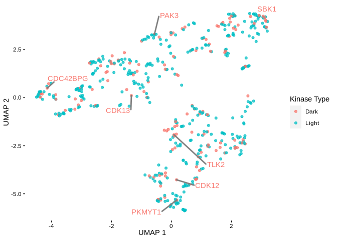
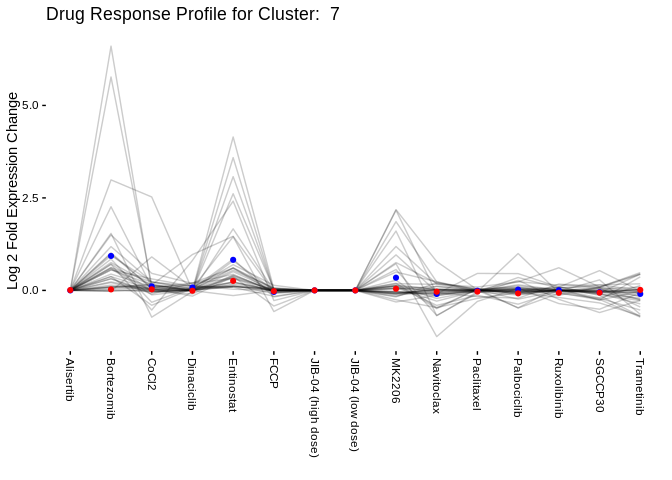
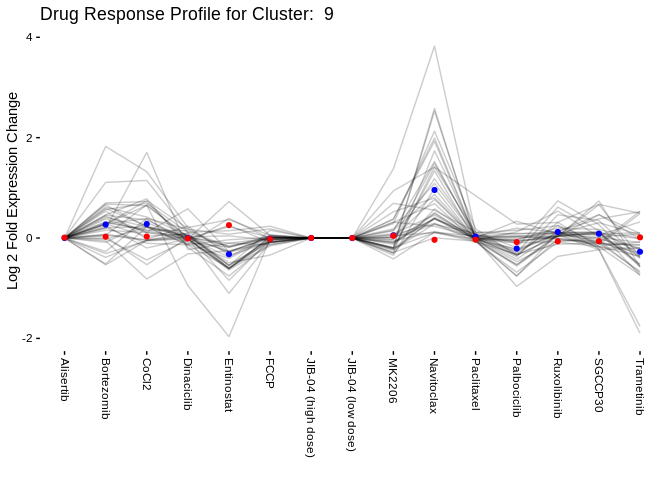

DESeq2 Output Clustering
================
Matthew Berginski
3/23/2020

# Read in DESeq2 Normalized Log Changes

## Data Organizing/Filtering

## Experiment UMAP Vis

``` r
ggplot(segment(ddata_x)) +
    geom_segment(aes(x=x, y=y, xend=xend, yend=yend)) +
    geom_text(data = dendro_labels,
                        aes(label = label, x=x,y=0), angle=90, hjust=1.1) +
    # ylim(c(-1,NA)) +
    xlab('') +
    theme_berginski() +
    theme(axis.title.x=element_blank(),
                axis.text.x=element_blank(),
                axis.ticks.x=element_blank()) +
    # scale_y_discrete("Correlation Distance", waiver(), waiver(), c(0,2)) +
    scale_y_continuous("Kinase Correlation Distance", breaks = c(0,0.5,1), limits = c(-0.8,NA))
```

<!-- -->

``` r
    NULL
```

    ## NULL

``` r
ggsave(here('figures/clustering/experiment_cluster_tree.png'),height=4,width=4)
trimImage(here('figures/clustering/experiment_cluster_tree.png'))
```

### UMAP on DESeq Log2 fold Results

``` r
umap_settings = umap.defaults

kinase_correlations_ratio_umap = drug_perturb_ratio_wide_kinases %>%
    column_to_rownames(var='hgnc_symbol') %>%
    umap() %>%
    identity()

kinase_ratio_plot = data.frame(umap_1 = kinase_correlations_ratio_umap$layout[,1],
                                                             umap_2 = kinase_correlations_ratio_umap$layout[,2],
                                                             symbol = drug_perturb_ratio_wide_kinases$hgnc_symbol) %>%
    left_join(all_kinases %>% select(symbol, class)) %>%
    mutate(label = case_when(
        # class == "Dark" ~ symbol,
        symbol == "PKMYT1" ~ symbol,
        symbol == "TLK2" ~ symbol,
        symbol == "BRSK2" ~ symbol,
        symbol == "CDK12" ~ symbol,
        symbol == "CDK13" ~ symbol,
        # symbol == "PIP5K1B" ~ symbol,
        TRUE ~ ""
    ))
```

    ## Joining, by = "symbol"

    ## Warning: Column `symbol` joining factors with different levels, coercing to
    ## character vector

``` r
library(ggrepel)
library(BerginskiRMisc)
ggplot(kinase_ratio_plot, aes(x=umap_1,y=umap_2,color = class,label = label)) +
    geom_point(alpha=0.75) + theme_berginski() + xlab('UMAP 1') + ylab('UMAP 2') +
    geom_text_repel(
        segment.size  = 0.2,
    segment.color = "grey50",
    force = 10)
```

<!-- -->

``` r
ggsave(here('figures/clustering/kinase_cluster_ratio_umap.png'))
```

    ## Saving 7 x 5 in image

``` r
kinase_correlations_ratio = amap::Dist(drug_perturb_ratio_wide_kinases %>% 
                                                                                column_to_rownames(var = "hgnc_symbol"),
                                                                             method="correlation")
```

``` r
umap_settings = umap.defaults
umap_settings$min_dist = 0.01
umap_settings$input = "dist"

kinase_correlations_ratio_umap = kinase_correlations_ratio %>%
    as.matrix() %>%
    umap(config = umap_settings)

kinase_ratio_plot = data.frame(umap_1 = kinase_correlations_ratio_umap$layout[,1],
                                                             umap_2 = kinase_correlations_ratio_umap$layout[,2],
                                                             symbol = drug_perturb_ratio_wide_kinases$hgnc_symbol) %>%
    left_join(all_kinases %>% select(symbol, class)) %>%
    mutate(label = case_when(
        # class == "Dark" ~ symbol,
        symbol == "PKMYT1" ~ symbol,
        symbol == "TLK2" ~ symbol,
        symbol == "BRSK2" ~ symbol,
        symbol == "CDK12" ~ symbol,
        symbol == "CDK13" ~ symbol,
        # symbol == "PIP5K1B" ~ symbol,
        TRUE ~ ""
    ))
```

    ## Joining, by = "symbol"

    ## Warning: Column `symbol` joining factors with different levels, coercing to
    ## character vector

``` r
library(ggrepel)
library(BerginskiRMisc)
ggplot(kinase_ratio_plot, aes(x=umap_1,y=umap_2,color = class,label = label)) +
    geom_point() + theme_berginski() + xlab('UMAP 1') + ylab('UMAP 2') +
    geom_text_repel(
        segment.size  = 0.2,
    segment.color = "grey50",
    force = 10)
```

<!-- -->

``` r
ggsave(here('figures/clustering/kinase_cluster_ratio_umap.png'))
```

    ## Saving 7 x 5 in image

## Output Kinase Cluster Lists

``` r
kinase_hier_clusters = as.data.frame(cutree(kinase_cluster_ratio,k = 15))
names(kinase_hier_clusters) <- "cluster_num"
kinase_hier_clusters = kinase_hier_clusters %>%
    rownames_to_column(var = "hgnc_symbol") %>%
    arrange(cluster_num, hgnc_symbol) %>%
    left_join(all_kinases %>% select(class, symbol), by=c('hgnc_symbol'='symbol')) %>%
    write_csv(here('cluster_sets/DESeq_kinase_correlation_clusters.csv'))
```

    ## Warning: Column `hgnc_symbol`/`symbol` joining character vector and factor,
    ## coercing into character vector

``` r
kinase_cluster_counts = kinase_hier_clusters %>% 
    count(cluster_num, name = "Total Kinases") %>%
    left_join(kinase_hier_clusters %>% filter(class == "Dark") %>% count(cluster_num, name="Understudied Count")) %>%
    left_join(kinase_hier_clusters %>% filter(class == "Light") %>% count(cluster_num, name="Well Studied Count")) %>%
    write_csv(here('cluster_sets/DESeq_kinase_correlation_counts.csv'))
```

    ## Joining, by = "cluster_num"
    ## Joining, by = "cluster_num"

``` r
umap_settings = umap.defaults
umap_settings$min_dist = 0.01
umap_settings$input = "dist"

kinase_correlations_ratio_umap = kinase_correlations_ratio %>%
    as.matrix() %>%
    umap(config = umap_settings)

kinase_ratio_plot = data.frame(umap_1 = kinase_correlations_ratio_umap$layout[,1],
                                                             umap_2 = kinase_correlations_ratio_umap$layout[,2],
                                                             symbol = drug_perturb_ratio_wide_kinases$hgnc_symbol) %>%
    left_join(all_kinases %>% select(symbol, class)) %>%
    left_join(kinase_hier_clusters %>% select(hgnc_symbol,cluster_num), by = c('symbol'='hgnc_symbol')) %>%
    mutate(label = case_when(
        # class == "Dark" ~ symbol,
        symbol == "PKMYT1" ~ symbol,
        symbol == "TLK2" ~ symbol,
        symbol == "BRSK2" ~ symbol,
        symbol == "CDK12" ~ symbol,
        symbol == "CDK13" ~ symbol,
        # symbol == "PIP5K1B" ~ symbol,
        TRUE ~ ""
    ))
```

    ## Joining, by = "symbol"

    ## Warning: Column `symbol` joining factors with different levels, coercing to
    ## character vector

``` r
library(ggrepel)
library(BerginskiRMisc)
ggplot(kinase_ratio_plot, aes(x=umap_1,y=umap_2,label = label, color=as.factor(cluster_num))) +
    geom_point() + theme_berginski() + xlab('UMAP 1') + ylab('UMAP 2') +
    geom_text_repel(
        segment.size  = 0.2,
    segment.color = "grey50",
    force = 10) +
    geom_mark_hull(concavity = 5,expand=0,radius=0,aes(fill=as.factor(cluster_num)))
```

<!-- -->

``` r
ggsave(here('figures/clustering/kinase_cluster_ratio_umap.png'))
```

    ## Saving 7 x 5 in image

## Output Kinase Cluster Lists

``` r
kinase_hier_clusters = as.data.frame(cutree(kinase_cluster_ratio,k = 15))
names(kinase_hier_clusters) <- "cluster_num"
kinase_hier_clusters = kinase_hier_clusters %>%
    rownames_to_column(var = "hgnc_symbol") %>%
    arrange(cluster_num, hgnc_symbol) %>%
    left_join(all_kinases %>% select(class, symbol), by=c('hgnc_symbol'='symbol')) %>%
    write_csv(here('cluster_sets/DESeq_kinase_correlation_clusters.csv'))
```

    ## Warning: Column `hgnc_symbol`/`symbol` joining character vector and factor,
    ## coercing into character vector

``` r
kinase_cluster_counts = kinase_hier_clusters %>% 
    count(cluster_num, name = "Total Kinases") %>%
    left_join(kinase_hier_clusters %>% filter(class == "Dark") %>% count(cluster_num, name="Understudied Count")) %>%
    left_join(kinase_hier_clusters %>% filter(class == "Light") %>% count(cluster_num, name="Well Studied Count")) %>%
    write_csv(here('cluster_sets/DESeq_kinase_correlation_counts.csv'))
```

    ## Joining, by = "cluster_num"
    ## Joining, by = "cluster_num"

## Visualize Changes in Kinase Expression

``` r
treatment_summary = DESeq_ratios %>% 
    group_by(treatment) %>%
    summarise(mean_log2 = mean(log2FoldChange,na.rm=T),
                        lower_log2 = tidy(t.test(log2FoldChange))$conf.low,
                        upper_log2 = tidy(t.test(log2FoldChange))$conf.high)

cluster_treatment_summary = DESeq_ratios %>% 
    left_join(kinase_hier_clusters) %>% 
    filter(!is.na(cluster_num)) %>%
    group_by(cluster_num,treatment) %>% 
    summarise(mean_log2 = mean(log2FoldChange,na.rm=T),
                        lower_log2 = tidy(t.test(log2FoldChange))$conf.low,
                        upper_log2 = tidy(t.test(log2FoldChange))$conf.high)
```

    ## Joining, by = "hgnc_symbol"

``` r
for (this_cluster in sort(unique(kinase_hier_clusters$cluster_num))) {
    this_plot = ggplot(cluster_treatment_summary %>% filter(cluster_num == this_cluster),
                                         aes(x=treatment,y=mean_log2, group=cluster_num)) +
        geom_pointrange(aes(ymin=lower_log2,ymax=upper_log2)) +
        ggtitle(paste('Drug Response Profile for Cluster: ', this_cluster)) +
        
        geom_pointrange(data = treatment_summary, 
                                        aes(ymin=lower_log2,ymax=lower_log2, group='overall'), color='blue',alpha=0.25) +
        
        theme_berginski() +
        theme(axis.text.x=element_text(angle = -90, hjust = 0,vjust=0.5)) +
        xlab('') +
        ylab('Average Shrunk Log2 Fold Change') +
        ylim(c(-2.5,2.5))
    print(this_plot)
}
```

<!-- --><!-- --><!-- --><!-- --><!-- --><!-- --><!-- --><!-- --><!-- --><!-- --><!-- --><!-- --><!-- --><!-- --><!-- -->
