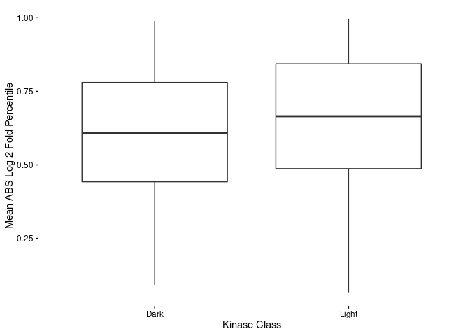

Gene Expression Plasticity
================
Matthew Berginski
3/23/2020

What is gene plasticity? How about we define it as changes in expression
due to perturbation. Great, we’ve got a pile of gene expression data in
the context of drug perturbations. So far, we’ve got 40 combinations of
drug (23) and cell lines (4) covered and included.

Specifically, we have the results of the DESeq2-based gene expression
analysis. The primary result of here are the log 2 fold change results
for each gene. This summarizes how much the gene expression changed in
comparison with the corresponding DMSO control. From this set of
results, I can see a few ways to measure the plasticity of these gene
responses:

  - Average of Fold Changes: Simple. What’s the average value of the
    fold changes for this gene, high values indicate a high plasticity
    gene.

  - Average of Absolute Value of the Fold Changes: Bit more complicated.
    Deals with the case when a gene’s expression is variable, but the
    direction of variation changes from condition to condition. In this
    case, a high fold change value in one treatment could be cancelled
    out by a low fold change in another treatment. I’d still say this
    gene has high plasticity though.

For both of these metrics, I’ve also collected the rank of every gene,
thinking that the raw fold change summary values aren’t in and of
themselves that informative.

Finally, I’ll also grabbed a list of Ion Channels and GPCRs from the GO
ontology to make some comparisons to our sibling IDG groups.

# Distribution of Mean Log Fold Changes

Here’s what the distribution of average log fold changes look like for
every gene split by protein class. This plot should be read as a
histogram normalized to deal with the differing number of genes in the
classes.

Every gene class is centered at zero, as expected, but the biggest take
away here is that the kinases have the fewest genes in the minimal
change category (lowest peak in near zero changes section of the plot)

Same data as above, except unstacking the histograms.

# Distribution of Mean ABS Fold Change

Here’s the same style normalized histogram for the distribution of the
mean of the absolute value of fold change in expression.

GPCRs really don’t change their expression levels in our treatments, do
they? Otherwise, kinases have the highest average values on this metric
as well.

Same data as above with the histograms spread out.

# Data Organized by Gene Ranks

The above numbers are only so meaningful to me though. Is a mean
absolute value of 2-fold variation of 0.35 high or low? So I’ve also
calculated the percentile rank of every gene based on the absolute value
fold change average from above. High values here indicate that a gene
has a higher average fold change (so 0.9 or 90% percentile gene has a
higher fold change than 90% of the genome).

The kinases have a stronger response here (average percentile: 0.64)
than the rest of the genome (p-value: 3.488963410^{-42}).

# Differences Between Light and Dark Kinases

Looking only at the kinases, we can take a look at differences in
ranking for the light vs dark kinases:

The light kinases are a bit higher on average than the dark kinases
(0.598 vs 0.651). The difference in class is significant, but is only a
few percent different.

## Most Plastic Light Kinases

Here’s the list of top 10 most plastic light kinases along with the
genome-wide percentile ranking:

<table>

<thead>

<tr>

<th style="text-align:left;">

hgnc\_symbol

</th>

<th style="text-align:right;">

gene\_fold\_abs\_mean\_rank

</th>

</tr>

</thead>

<tbody>

<tr>

<td style="text-align:left;">

HKDC1

</td>

<td style="text-align:right;">

0.9965435

</td>

</tr>

<tr>

<td style="text-align:left;">

TRIB1

</td>

<td style="text-align:right;">

0.9945379

</td>

</tr>

<tr>

<td style="text-align:left;">

MAP2K6

</td>

<td style="text-align:right;">

0.9928309

</td>

</tr>

<tr>

<td style="text-align:left;">

AURKB

</td>

<td style="text-align:right;">

0.9913800

</td>

</tr>

<tr>

<td style="text-align:left;">

PLK1

</td>

<td style="text-align:right;">

0.9907400

</td>

</tr>

<tr>

<td style="text-align:left;">

HK2

</td>

<td style="text-align:right;">

0.9870701

</td>

</tr>

<tr>

<td style="text-align:left;">

BUB1B

</td>

<td style="text-align:right;">

0.9869421

</td>

</tr>

<tr>

<td style="text-align:left;">

TRIB3

</td>

<td style="text-align:right;">

0.9848511

</td>

</tr>

<tr>

<td style="text-align:left;">

PBK

</td>

<td style="text-align:right;">

0.9833148

</td>

</tr>

<tr>

<td style="text-align:left;">

CDC7

</td>

<td style="text-align:right;">

0.9831015

</td>

</tr>

</tbody>

</table>

## Most Plastic Dark Kinases

Here’s the list of top 10 most plastic light kinases along with the
genome-wide percentile ranking:

<table>

<thead>

<tr>

<th style="text-align:left;">

hgnc\_symbol

</th>

<th style="text-align:right;">

gene\_fold\_abs\_mean\_rank

</th>

</tr>

</thead>

<tbody>

<tr>

<td style="text-align:left;">

PKMYT1

</td>

<td style="text-align:right;">

0.9887770

</td>

</tr>

<tr>

<td style="text-align:left;">

ALPK3

</td>

<td style="text-align:right;">

0.9720065

</td>

</tr>

<tr>

<td style="text-align:left;">

RIOK3

</td>

<td style="text-align:right;">

0.9696168

</td>

</tr>

<tr>

<td style="text-align:left;">

CDC42BPG

</td>

<td style="text-align:right;">

0.9613382

</td>

</tr>

<tr>

<td style="text-align:left;">

CDK18

</td>

<td style="text-align:right;">

0.9492191

</td>

</tr>

<tr>

<td style="text-align:left;">

NRBP2

</td>

<td style="text-align:right;">

0.9481096

</td>

</tr>

<tr>

<td style="text-align:left;">

STK32A

</td>

<td style="text-align:right;">

0.9367159

</td>

</tr>

<tr>

<td style="text-align:left;">

CLK3

</td>

<td style="text-align:right;">

0.9251942

</td>

</tr>

<tr>

<td style="text-align:left;">

STK17A

</td>

<td style="text-align:right;">

0.9172143

</td>

</tr>

<tr>

<td style="text-align:left;">

PIK3C2B

</td>

<td style="text-align:right;">

0.9140138

</td>

</tr>

</tbody>

</table>
